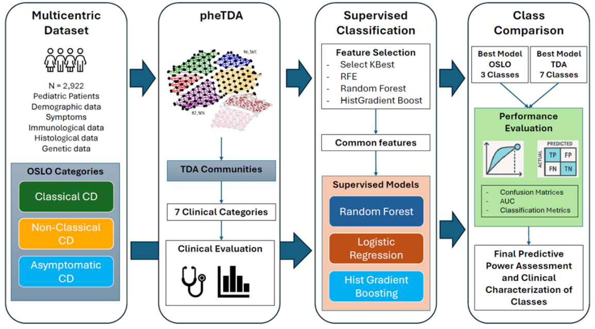

Code for *A New Computational Phenotyping Framework for the Clinical Characterization of Pediatric Celiac Disease*. <br>
G. Albi, V. Brembilla, E. Lenzi, S. Maffioletti, E. Medolago, C. Sirtoli, A. Ferramosca, M.V. Lenti, A. Di Sabatino, A. Dagliati, and D. Pala

<p align="center">

</p>

## :file_folder: Repository layout
```
pediatric_celiac_disease/      
  Data_exploration_part1.ipynb          # dataset inspection and preprocessing
  Data_exploration_part2.ipynb          # dataset inspection and preprocessing
  TDA_mapper.ipynb                      # to run the grid search for Mapper
  Computational_phenotyping.ipynb       # to run the TDA Mapper pipeline 
  Clustering_Analysis.ipynb             # analysis with traditional clustering for comparison
```
